# ROS2 Jazzy + CARLA — EKF (robot_localization) Multi-capteurs (Odom / IMU / GNSS)

Ce dépôt documente notre travail d’évaluation d’un **filtre de Kalman étendu (EKF)** avec **ROS2 Jazzy** et un rosbag CARLA.
Nous comparons la sortie du filtre `/odometry/filtered` à la référence CARLA `/carla/hero/odometry`, en **offline (CSV)** et en **temps réel (topics ROS2)**.

---

## 1) Environnement

- ROS2 Jazzy (Ubuntu/Linux)
- Workspace : `~/ros2_ws`
- Rosbag : `~/Téléchargements/carla_data/carla_data_0.db3` (~34 s)
- Python venv : `~/ros2_ws/.venv_py3/` (numpy/pandas/matplotlib/pyyaml)

### Topics utilisés (rosbag)
- Référence (GT) : `/carla/hero/odometry` (`nav_msgs/Odometry`)
- IMU : `/carla/hero/imu` (`sensor_msgs/Imu`)
- GNSS : `/carla/hero/gnss` (`sensor_msgs/NavSatFix`)
- `/tf`, caméras, LiDAR… (présents mais non utilisés ici)

---

## 2) Objectif du projet

1. Évaluer plusieurs configurations EKF et la **fusion multi-capteurs**.
2. Calculer des métriques (RMSE, erreurs x/y, norme 2D, yaw, latence…).
3. Passer progressivement de l’analyse **offline** à une chaîne **temps réel** basée sur les **topics ROS2**.
4. Relier la théorie EKF (**prédiction/correction + Q/R/P0**) aux résultats (courbes/erreurs/stabilité).

---

## 3) Rappel EKF — Prédiction / Correction (concept clé)

L’EKF alterne deux étapes :

### 3.1 Prédiction (Prediction)
L’état est propagé dans le temps via un modèle de mouvement et l’incertitude est mise à jour avec la covariance de processus **Q**.

<p align="center">
  
  <br/>
  
</p>

### 3.2 Correction (Update)
À l’arrivée d’une mesure, l’état est corrigé via le gain de Kalman, pondéré par la covariance de mesure **R** (confiance capteur).

<p align="center">
  
  <br/>
  
  <br/>
  
  <br/>
  
</p>

**Interprétation (réglages) :**
- **Q ↑** : le modèle est jugé moins fiable → corrections plus “réactives”, parfois plus bruitées.
- **R ↑** : le capteur est jugé moins fiable → il influence moins l’estimation.
- **P0 ↑** : convergence initiale plus rapide, mais transitoires possibles.

---

## 4) Démarrage rapide

### 4.1 Sourcing
```bash
source /opt/ros/jazzy/setup.bash
source ~/ros2_ws/install/setup.bash
```

### 4.2 Lecture du rosbag (temps simulé)
```bash
ros2 bag play ~/Téléchargements/carla_data/carla_data_0.db3 --clock --loop
```

Vérifier que `/clock` tourne :
```bash
timeout 3 ros2 topic echo /clock --once
```

---

## 5) Expériences offline (RUN1 → RUN3)

### Méthode de comparaison
- **GT** : `/carla/hero/odometry`
- **EST** : `/odometry/filtered` (sortie EKF)
- Logger : synchronisation **arrival-time** (robuste si bases de temps différentes)
- Analyse : erreurs (ex, ey, e2d, eyaw), RMSE, histogrammes, trajectoires 2D

---

### RUN1 — EKF odom seul
**Contexte.** Le filtre utilise uniquement l’odométrie comme mesure de correction.

**Figures (RUN1).**
<p align="center">
  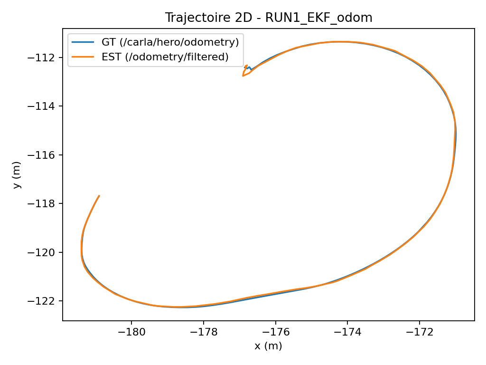
</p>
<p align="center">
  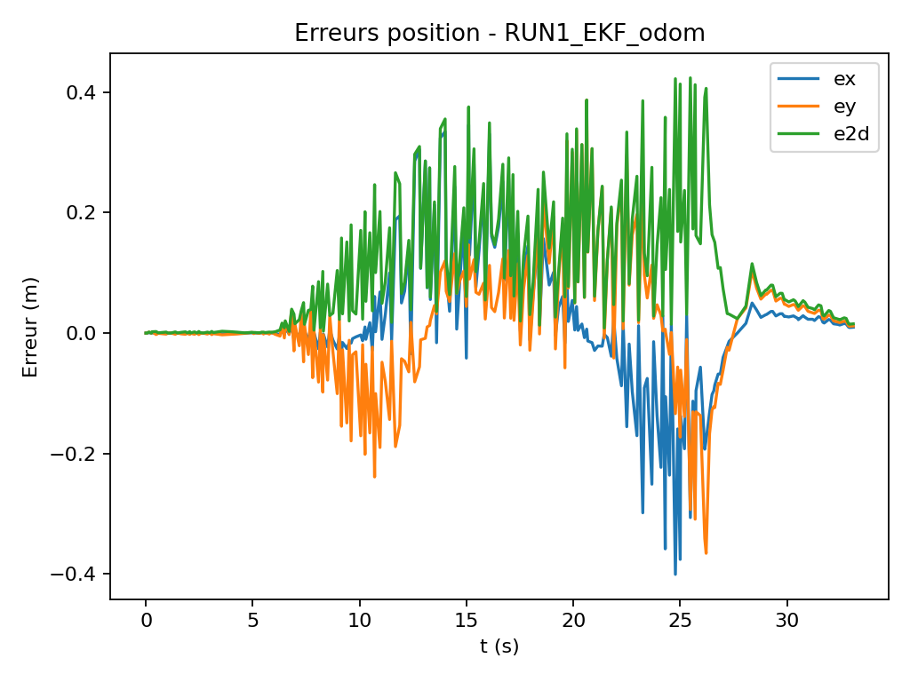
</p>
<p align="center">
  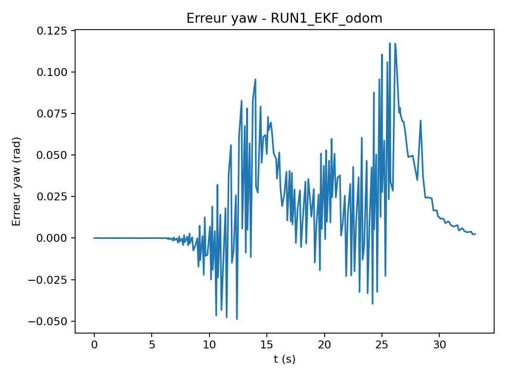
</p>
<p align="center">
  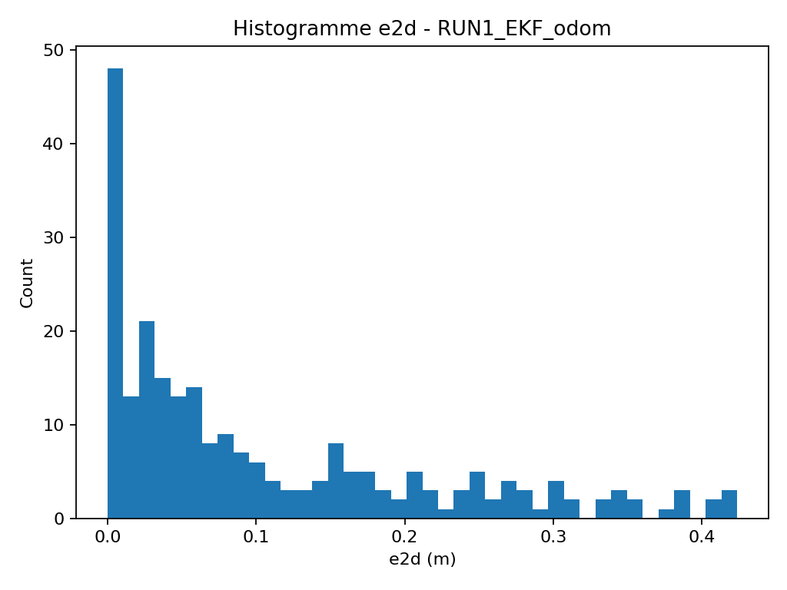
</p>

**Interprétation (synthèse).**
- La trajectoire estimée se superpose globalement à la GT (figure *traj2d*).
- Les erreurs \(e_x, e_y\) et \(e2d\) restent faibles la plupart du temps, avec des pics ponctuels (souvent liés à la synchronisation et au jitter).
- L’erreur de yaw reste limitée comparée aux runs incluant l’IMU dans notre cas.

---

### RUN2 — EKF odom + IMU
**Contexte.** Ajout de l’IMU : le filtre corrige aussi l’orientation/taux angulaire selon la configuration.

**Figures (RUN2).**
<p align="center">
  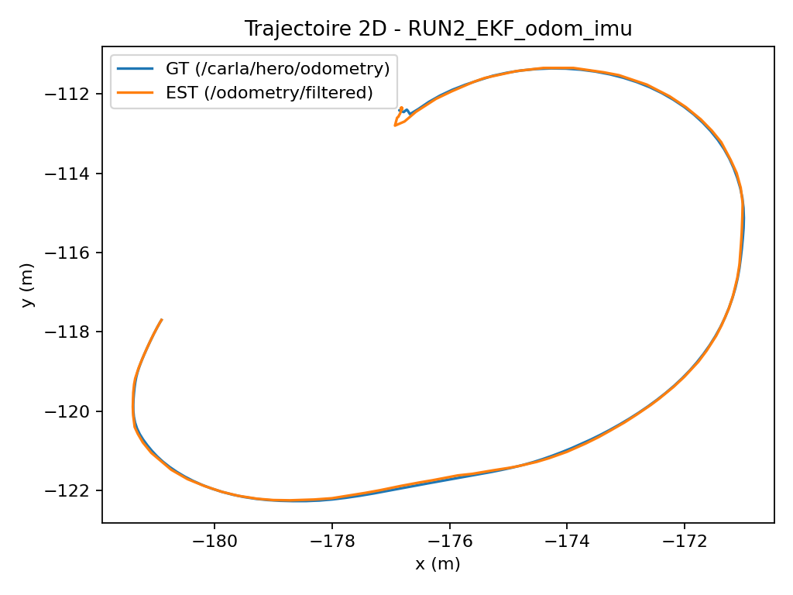
</p>
<p align="center">
  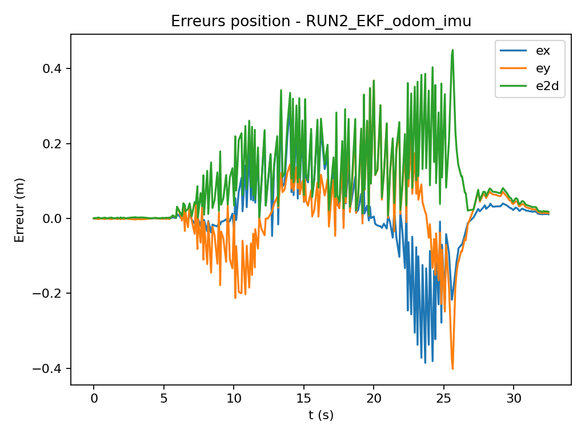
</p>
<p align="center">
  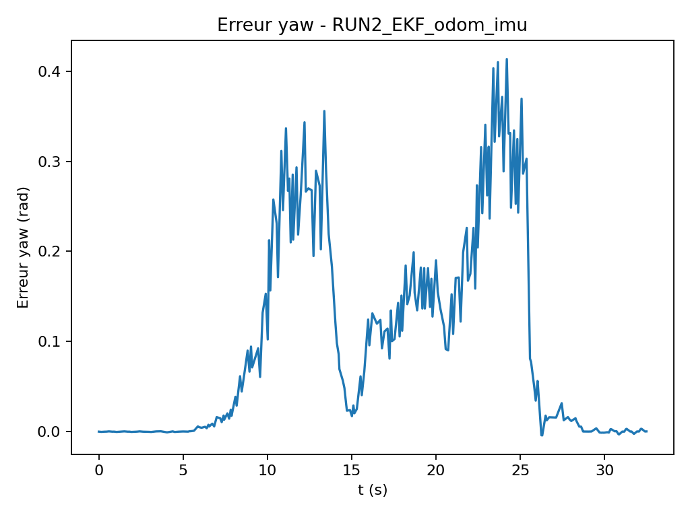
</p>
<p align="center">
  
</p>

**Interprétation (synthèse).**
- La trajectoire 2D reste proche de la GT.
- En revanche, l’erreur de yaw présente des écarts plus marqués (courbe *error_yaw*), cohérents avec une IMU dont les covariances sont nulles / peu réalistes dans le rosbag (et donc une pondération potentiellement inadéquate).

---

### RUN3 — EKF odom + IMU + GNSS (pipeline GNSS)
**Contexte.** Fusion GNSS avec `navsat_transform_node` pour obtenir une estimation globale (selon la configuration de la stack).

**Figures (RUN3).**
<p align="center">
  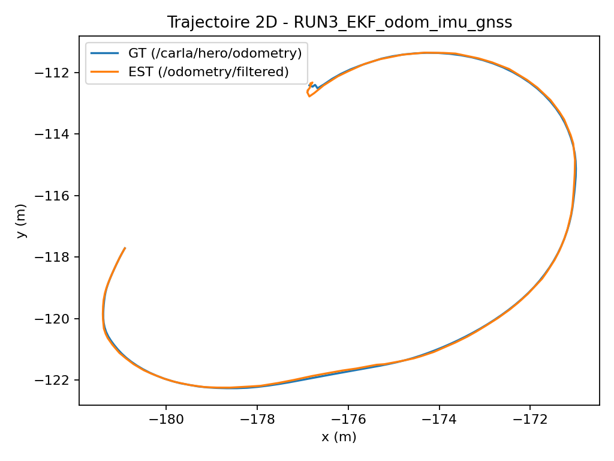
</p>
<p align="center">
  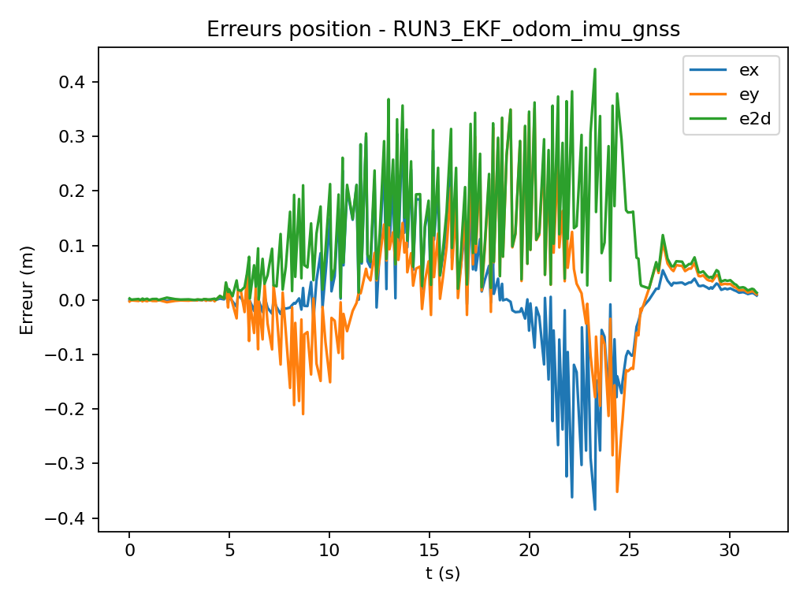
</p>
<p align="center">
  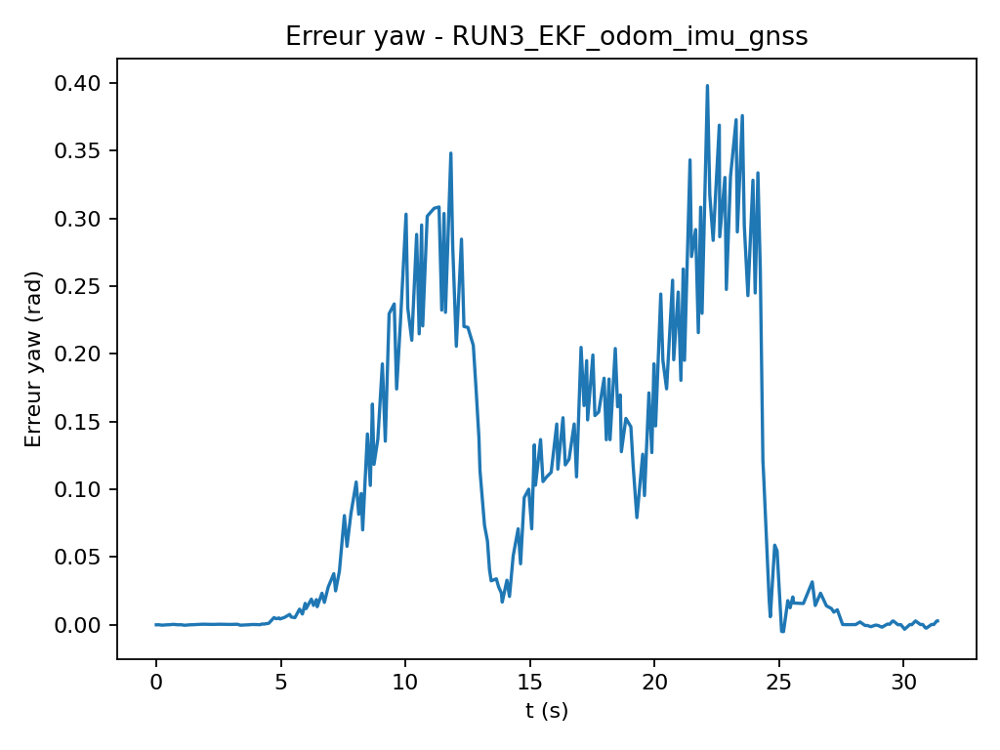
</p>
<p align="center">
  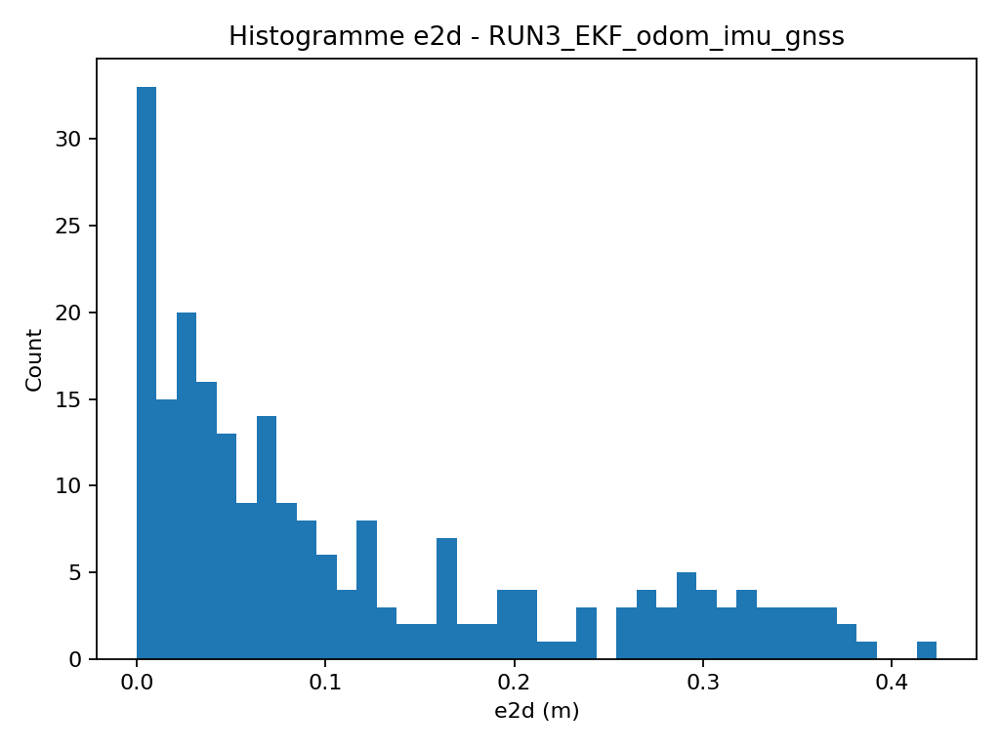
</p>

**Interprétation (synthèse).**
- La trajectoire 2D reste globalement cohérente avec la GT.
- Les erreurs positionnelles restent du même ordre de grandeur que RUN2, ce qui est attendu sur des données CARLA “propres”.
- Les différences entre configurations deviennent plus visibles lorsqu’on injecte du bruit (ex. `odom_noiser`) ou lorsque l’on ajuste \(Q/R/P0\).

---

## 6) Passage au temps réel — métriques en ligne (démo)

### Principe
Au lieu de passer par un CSV, on calcule les erreurs en direct via souscription ROS2 :
- GT : `/carla/hero/odometry`
- EST : `/odometry/filtered`
- métriques : `/metrics/e2d`, `/metrics/rmse2d_window` (fenêtre glissante)

### Comparateur live (arrival-time)
```bash
python3 ~/ros2_ws/src/my_py_pkg/scripts/online_compare_arrival.py
```

Vérification :
```bash
ros2 topic list | grep "/metrics"
timeout 5 ros2 topic hz /metrics/e2d
timeout 5 ros2 topic echo /metrics/e2d --once
```

### Plot live minimal (matplotlib)
```bash
python3 ~/ros2_ws/src/my_py_pkg/scripts/live_plot_metrics_min.py
```

**Figure TR-1 — Capture d’une courbe live (e2d + RMSE fenêtre).**
<p align="center">
  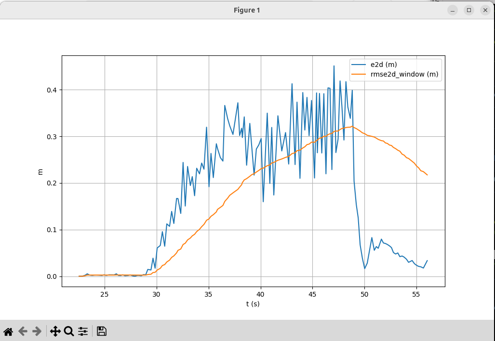
</p>

[Screencast from 2025-12-30 00-25-08.webm](https://github.com/user-attachments/assets/fafc8df0-83fd-456d-9e58-756486a8d5e3)


**Interprétation TR-1 (synthèse).**
- `e2d` fluctue avec des pics (jitter / désalignement entre flux) ; la RMSE glissante suit une tendance plus lisse.
- Une chute brutale de `e2d` peut indiquer un retour à une meilleure cohérence instantanée entre GT et estimation.
- Cette chaîne valide l’objectif “temps réel” attendu : topics → métriques → visualisation live.

---

## 7) Organisation du dépôt (proposée)

```
.
├── src/my_py_pkg/scripts/
│   ├── compare_logger_arrival.py
│   ├── analyze_csv.py
│   ├── summarize_runs.py
│   ├── online_compare_arrival.py
│   └── live_plot_metrics_min.py
├── config/
│   └── gnss_fusion/...
└── docs/
    └── figures/
        ├── ekf_equations/
        ├── runs/
        └── realtime/
```

---

## 8) Suite (RUN4 recommandé)
- Tester un scénario où les différences entre configs sont plus visibles :
  - injection de bruit (odom_noiser)
  - étude paramétrique \(Q/R/P0\) (sensibilité)
- Ajouter une configuration alternative (ex. IMU gyro-only, UKF…) pour analyser l’impact sur yaw et la stabilité.

---
